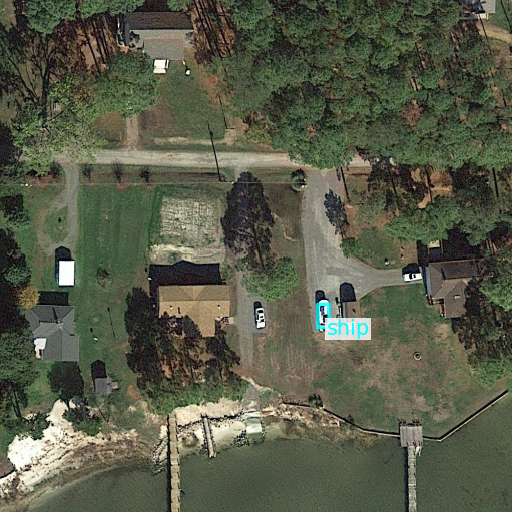
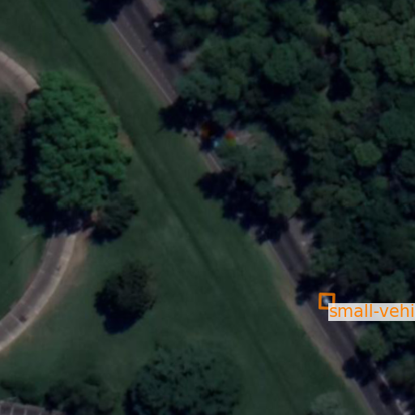

# Is there a needle in the Haystack?
We introduce a simple approach to identify novel class objects within aerial images, without specify these novel classes
ahead of time. In our setting, we are equipped with a detector capable of detecting a closed set of objects 
(e.g., vehicles, planes) but wish to determine if other, unspecified, object classes, that are of interest (say, ships),
appear in the images as well. we propose a funnel approach that gradually reduces the number of patches of interest from 
tens of millions to a short list of few tens of thousands. The patches in the short list are ranked automatically and 
shown to a human operator. We therefore measure performance by Time-To-$1^{\text{st}}$ (TT-1), i.e. the time it takes a 
human to find the first instance of interesting new classes in aerial images, and show we are capable of producing such 
a sample within the first few patches.

<p align="center">
  
  
</p>

**Is there a needle in the Haystack?**: How many patches must a user inspect to detect the first instance of a new class (Time-To-First)? Given the DoTAv2 dataset and a detector trained on in-distribution classes **Small Vehicle, Large-Vehicle,** and **Swimming-Pool**, the algorithm analyzes all patches in the dataset, scores them, and presents them in order to the user.
The **TT-1 of Ship** is **13** (left). Similarly, given a detector trained on **Storage-Tank, Tennis-Court,** and **Swimming-Pool**, the **TT-1 of Small-Vehicle** is **139** (right).
This means that out of tens of millions of patches in the dataset, a user needs to inspect only a few hundred patches to determine the existence of novel object classes.

## Requirements
You should clone this repo, mmrotate and mmdet repos according to the following branches:

mmrotate - https://github.com/ShovalMishal/mmrotate/tree/dev-1.x

mmdet - https://github.com/ShovalMishal/mmdection/tree/dev-3.x

Then, you should create an environment based on the environment.yml.
You should install the aforementioned branches in the new environment via the following command:
```shell
pip install -e /path/to/local/repo
``` 

There is a preprocess stage which aims to normalize the aerial images according to gsd values which is a part of the pipeline. It requires the DOTAV2 Dataset, seperated to train, validation and test datasets.

## Training and testing full pipeline
You need to update the relevant configurations in the config file, which is in this repo and supply it to the main script by running the following command:
```shell
python ./FullOODPipeline.py -c ./config.py 
``` 
According to our pipeline, the anomaly detection runs and extracting objective bounding boxes according to dino vit results. Then the bounding boxes are finetuned using the bounding box regressor.
Later, the classifier is fine-tuned for the OOD stage. 
Finally, you get the statistics for the OOD detection experiment.
